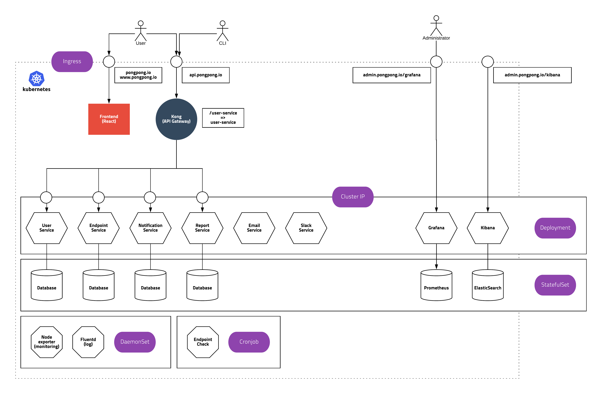

# microservices x kubernetes study

단순한 (하지만 현실적인) 서비스를 마이크로서비스 형태로 만들어 기본 철학을 이해하고 쿠버네티스를 이용하여 배포, 모니터링, 확장하면서 실제적인 사용법을 익히는게 목적입니다.

마이크로서비스를 제대로 구축한다는 것은 굉장히 어렵기 때문에 여기서는 단순하게 API Gateway + REST API 패턴을 사용하고 왜 안티패턴인지 느껴보는 정도로 진행합니다.

- [pongpong 프로젝트 소개](#pongpong)
    - [Frontend](#frontend)
    - [Pong CLI](#pong-cli)
    - [API Gateway / Kong](#api-gateway)
    - [Service Mesh / Istio](#service-mesh)
    - [User Service](#user-service)
    - [Endpoint Service](#endpoint-service)
    - [Notification Service](#notification-service)
    - [Report Service](#report-service)
    - [Email Service](#email-service)
    - [Slack Service](#slack-service)
    - [Endpoint Check](#endpoint-check)
    - [Logging](#logging)
    - [Monitoring](#monitoring)
- [서비스 작성 규칙](#서비스-작성-규칙)
    - [기본 규칙](#기본-규칙)
    - [REST API 설계](#rest-api-설계)
    - [Kubernetes Spec](#kubernetes-spec)
- [Kong 기본 개념](#kong-기본-개념)
    - [Kong 구성](#kong-구성)
    - [Kong API](#kong-api)
    - [Consumer](#consumer)
    - [Key Authentication](#key-authentication)

## pongpong

pongpong(가칭)은 https://apex.sh/ping/ 클론 프로젝트 입니다. 체크 하고 싶은 웹 서비스 주소를 입력하면 주기적으로 체크하고 결과를 알려줍니다.



### Frontend

- service
    - type - `Ingress`
    - host - `pongpong.io`, `www.pongpong.io`
    - path - `/`
    - serviceName - `frontend`
    - servicePort - `80`

User가 browser로 접속해서 서비스를 사용하는 Webapp

https://github.com/k8s-study/frontend @subicura

### Pong CLI

터미널에서 실행가능한 클라이언트

https://github.com/k8s-study/pong-cli @anarcher


### API Gateway

- service
    - type - `Ingress`
    - host - `api.pongpong.io`
    - path - `/`
    - serviceName - `kong-proxy`
    - servicePort - `80`
- service
    - type - `ClusterIP`
    - path - `/`
    - serviceName - `kong-ingress-controller`
    - servicePort - `8001`

Kong 사용. 간략한 개념은 뒷부분에서 다시 설명

https://github.com/k8s-study/kong @Ashon

### Service Mesh

[Istio](https://istio.io/)를 이용하여 마이크로서비스간 통신을 관리

TCP(DB)를 제외하고 http통신을 사용하는 서비스만 사용하게 설정

### User Service

- service
    - type - `ClusterIP`
    - serviceName - `user-service`
    - servicePort - `80`
- kong api
    - uris - `/user-service`
    - upstream api - `http://user-service`
- Public API
    - 유저 CRUD + 로그인 / 로그아웃
- Private API
    - 유저 리스트 조회 / 유저 상세 조회

유저를 생성하고 정보를 수정하고 로그인 및 로그아웃 처리

Kong의 consumer를 관리하고 Kong의 `key-auth` plugin을 이용하여 key를 조회함

https://github.com/k8s-study/user-service @outsideris

### Endpoint Service

- service
    - type - `ClusterIP`
    - serviceName - `endpoint-service`
    - servicePort - `80`
- kong api
    - uris - `/endpoint-service`
    - upstream api - `http://endpoint-service`
- Public API
    - 엔드포인트 CRUD
- Private API
    - 엔드포인트 리스트 조회 / 엔드포인트 상세 조회

웹서비스가 살았는지 체크 하기 위한 목록을 관리

ex) http://google.com

https://github.com/k8s-study/endpoint-service @findstar

### Notification Service

- service
    - type - `ClusterIP`
    - serviceName - `notification-service`
    - servicePort - `80`
- kong api
    - uris - `/notification-service`
    - upstream api - `http://notification-service`
- Public API
    - 알람 설정 CRUD
    - 알람 호출(테스트)
- Private API
    - 알람 리스트 조회 / 알람 상세 조회
    - 알람 호출

웹서비스가 죽었을때 알람을 어디로 전송할지 정보를 관리

현재 이메일, 슬랙 알람을 지원하며 관련 인증 정보를 관리하고 해당 서비스를 호출하는 역할을 함

https://github.com/k8s-study/notification-service @b6pzeusbc54tvhw5jgpyw8pwz2x6gs

### Report Service

- service
    - type - `ClusterIP`
    - serviceName - `report-service`
    - servicePort - `80`
- kong api
    - uris - `/report-service`
    - upstream api - `http://report-service/api`
- Public API
    - 리포트 리스트 조회 / 리포트 상세 조회
- Private API
    - 리포트 생성

엔드포인트 체크가 호출한 결과를 저장

리스트 조회 쿼리에 날짜를 쿼리 파라미터로 받음

https://github.com/k8s-study/report-service @SsureyMoon

### Email Service

- service
    - type - `ClusterIP`
    - serviceName - `email-service`
    - servicePort - `80`
- Internal API
    - 이메일 전송

받는사람, 제목, 내용을 인자로 이메일을 전송

https://github.com/k8s-study/email-service

### Slack Service

- service
    - type - `ClusterIP`
    - serviceName - `slack-service`
    - servicePort - `80`
- Internal API
    - 슬랙 메시지 전송

도메인, 채널, 내용, token을 인자로 슬랙 메시지 전송

https://github.com/k8s-study/slack-service @asbubam

### Endpoint Check

- service
    - type - `ClusterIP`
    - serviceName - `endpoint-check`
    - servicePort - `80`
- Internal API
    - 체크

사용자 요청 또는 주기적으로 endpoint가 정상인지 체크

https://github.com/k8s-study/endpoint-check @tedpark

### Logging

- service
    - type - `Ingress`
    - host - `admin.pongpong.io`
    - path - `/kibana`
    - serviceName - `logging-kibana`
    - servicePort - `80`
- \+ agent services

로깅

https://github.com/k8s-study/logging @posquit0

### Monitoring

- service
    - type - `Ingress`
    - host - `admin.pongpong.io`
    - path - `/grafana`
    - serviceName - `monitoring-grafana`
    - servicePort - `80`
- \+ agent services

모니터링

https://github.com/k8s-study/monitoring @yoanp

## 서비스 작성 규칙

### 기본 규칙

어떤 언어/디비를 사용해도 OK

외부에 공개할(Public) API와 내부 서비스끼리만 사용할(Private) API로 나눔

**Folder Structure**

- README.md: Instruction & Development guide
- k8s: kubernetes spec
- docs: swagger
  - public-spec.yaml (Public API)
  - private-spec.yaml (Private API)

### REST API 설계

REST API 설계는 다음 규칙을 준수합니다.

**Path Naming**

- health check - `/health` 접속시 `ok`(text) 리턴
- Public API - `/public`으로 endpoint 설정
- Private API - `/private`으로 endpoint 설정
- 기본적인 명명법은 `_ underscore` 방식 사용

**Status Code**

- 200: 성공
- 201: 생성 (create)
- 204: 컨텐츠 없음 (delete)
- 400: 잘못된 요청
- 401: login이 필요한 경우
- 403: login은 되어 있으나 권한이 없는 경우
- 404: not found
- 500: server error

**Response sample**

- 상세

```
{
  "id": 1, 
  "title": "title"
}
```

- 페이징

parameters - `page` (1,2,3,... default 1), `per_page` (default 20)

```
{
  "items": [{
    "id": 1,
    "content": "content 1"
  }],
  "page": {
    "current_page": 1,
    "total_count": 1,
    "per_page": 15
  }
}
```

- 호출류(CRUD가 아닌 경우)

```
{
  "status": "ok"
}
```

```
{
  "status": "fail"
}
```

- 에러

```
{
  "message":"에러메시지입니다.",
  "code": "ERROR"
}
```

```
{
  "message":"이메일 또는 비밀번호가 잘못되었습니다.",
  "code": "INVALID_LOGIN"
}
```

### Kubernetes Spec

Istio에서 자동으로 수집하는 정보의 값을 설정하기 위해 다음 규칙을 지킴

- Kong Ingress 설정
- 다음을 참고하여 거의 유사하게 설정함

```
apiVersion: extensions/v1beta1
kind: Ingress
metadata:
  name: user-service
  annotations:
    key-auth.plugin.konghq.com: "key-auth-plugin"
    cors.plugin.konghq.com: "cors-plugin"
spec:
  rules:
  - host: api.pongpong.io
    http:
      paths:
      - path: /user-service
        backend:
          serviceName: user-service
          servicePort: 80
---

apiVersion: configuration.konghq.com/v1
kind: KongIngress
metadata:
  name: user-service
proxy:
  path: /public
route:
  strip_path: true
upstream:
  service_upstream: true
```

- Service port 이름을 `http`로 설정해야 prometheus에 정상적으로 로그를 담음

```
apiVersion: v1
kind: Service
metadata:
  name: user-service
spec:
  ports:
  - port: 80
    targetPort: 8080
    name: http      # http로 설정
  selector:
    type: api
    app: user-service
```

- Deployment 라벨중 `app`과 `version`을 로깅에서 사용함

```
apiVersion: apps/v1
kind: Deployment
metadata:
  name: user-service
spec:
  template:
    metadata:
      labels:
        type: api
        app: user-service # app 사용
        version: v1       # version 사용
```

- readinessProbe/livenessProbe는 exec 명령어 사용
- httpGet을 사용할 수 없음(Istio가 해당 포트를 proxy하기 때문에)

```
readinessProbe:
  exec:
    command:
    - curl
    - -f
    - http://localhost:8080/health
  periodSeconds: 5
livenessProbe:
  exec:
    command:
    - curl
    - -f
    - http://localhost:8080/health
  initialDelaySeconds: 10
  periodSeconds: 5
```

- 내부 서비스에서 외부 주소(api.pongpong.io)를 호출할 수 있게 route rule 추가

```
apiVersion: config.istio.io/v1alpha2
kind: RouteRule
metadata:
 name: user-service-rewrite-rule
spec:
  destination:
    service: kong-proxy.kong.svc.cluster.local
  match:
    request:
      headers:
        uri:
          prefix: /user-service
  rewrite:
    authority: api.pongpong.io
```

## Kong 기본 개념

### Kong 구성

- 외부 API (api.pongpong.io:80)
    - user가 호출하는 API
- 관리자 API (kong-ingress-controller.kong:8001)
    - consumer를 만들거나 key-auth plugin을 통해 key를 가져옴
- postgresql (cassandra 지원하긴함)

### Kong API

기본적으로 유저는 kong api gateway를 호출하고 kong이 다시 내부 서비스를 호출합니다.

- uris - 유저가 호출하는 uri ex) `/user-service`
- upstream url - uris 규칙으로 들어온 요청을 어디로 전달할지 설정 ex) `http://user-service/api`
- strip uri - 유저가 `https://api.pongpong.io/user-service/v1/users/1`를 요청하면 `/user-service`를 제거하고 upstream을 요청할때는 `https://api.pongpong.io/public/v1/users/1`을 전달함

### Consumer

consumer는 user와 비슷하지만 다른 개념입니다. 

내부적으로 관리하는 user id를 이용하여 consumer를 등록합니다. 웹 / iOS / Android에 따라 한 user가 여러개의 consumer를 사용할 수 있으나 여기서는 하나의 user는 하나의 consumer입니다.

`subicura`라는 user를 생성하면 기본적으로 kong의 consumer를 `subicura`라는 user_id로 생성합니다. consumer는 user_id 외에 어떤 정보도 가지고 있지 않으며 단지 `key-auth` plugin을 통해 token을 관리하게 됩니다.

`user service`를 통해 로그인을 성공하면 `user service`는 kong의 consumer의 key를 조회하고 응답합니다. 추후 유저는 해당 키를 모든 요청의 header에 실어서 보냅니다.

### Key Authentication

https://getkong.org/plugins/key-authentication/

Kong에 기본으로 내장되어 있는 authentication plugin 입니다.

Header 또는 parameter로 `apikey` 값을 전달하면 key-auth plugin이 자동으로 해당 키를 가지고 있는 consumer를 조회 하고 upstream api를 호출할 때 `X-Consumer-Custom-ID`를 붙여서 전달합니다.

마이크로서비스는 `X-Consumer-Custom-ID`가 있으면 로그인한걸로 판단하고 없으면 로그인하지 않은것으로 판단합니다.
